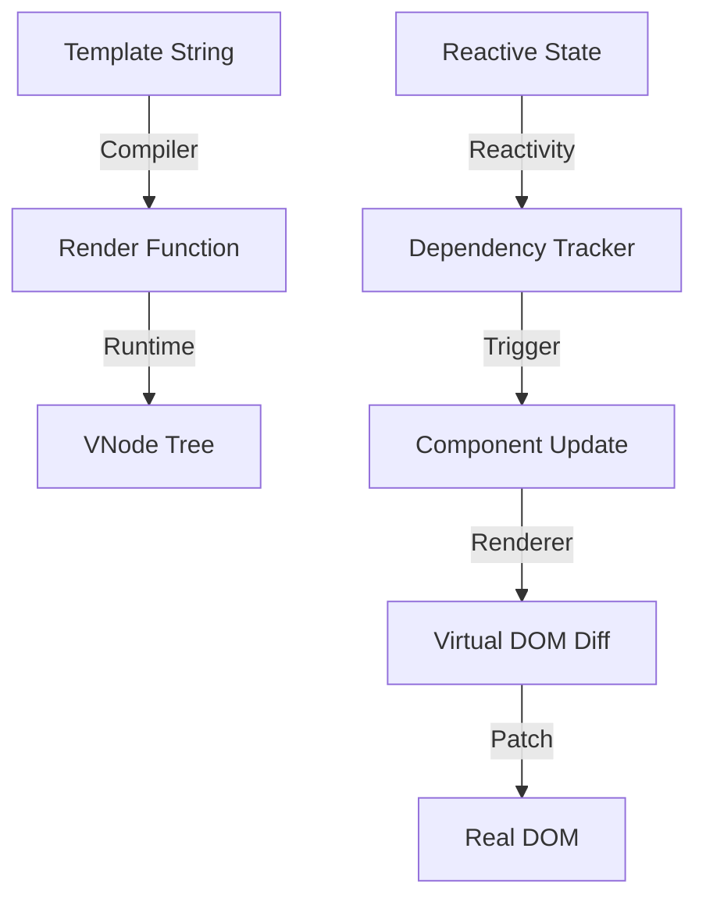

# 🚀 NeoJS Framework

NeoJS is a high-performance, academic JavaScript framework built from the ground up to demonstrate the architectural patterns used by professional tools like Vue, React, and Angular.

## 🏗️ Internal Architecture

NeoJS is designed as a modular monorepo. Here is how the systems interact:



### 1. Reactivity System
Located in `packages/reactivity`. Uses `Proxy` to intercept object operations. When a property is read, it is "tracked". When it's changed, it "triggers" effects (like re-rendering).

### 2. Core (The Brain)
Located in `packages/core`. Features an async **Scheduler** that batches multiple state changes into a single DOM update using microtasks, preventing "jank".

### 3. Virtual DOM Renderer
Located in `packages/renderer`. Instead of touching the DOM directly, NeoJS creates a lightweight JS description of the UI (VNode). The **Diffing Algorithm** compares the old tree with the new one to apply the minimum necessary changes.

### 4. Template Compiler
Located in `packages/compiler`. Parses standard HTML templates into optimized JavaScript render functions.

### 5. Runtime
Located in `packages/runtime`. The "glue" that manages component instances, props, and lifecycle events.

---

## 🛠️ Getting Started

### Project Setup
1. **Clone the repo** and navigate to the directory.
2. **Create a project** using the CLI:
   ```bash
   node cli/index.js create my-app
   ```
3. **Start the dev server**:
   ```bash
   node cli/index.js serve
   ```

### Running Tests
Verify the reactivity engine:
```bash
npm run test:reactivity
```

---

## 🤝 How to Contribute

We love contributions! Whether it's fixing a bug, adding a feature, or improving documentation.

### Contribution Process
1. **Fork the repository**.
2. **Create a branch** for your feature: `git checkout -b feature/amazing-logic`.
3. **Draft your changes**. Ensure you follow the modular pattern.
4. **Add a test case** if you're adding logic (see `packages/reactivity/test.js` for inspiration).
5. **Submit a Pull Request**.

### Areas for Improvement
- [ ] **Renderer**: Implement a keyed-diffing algorithm for better list performance.
- [ ] **Compiler**: Add support for static hoisting optimizations.
- [ ] **CLI**: Add a `build` command to bundle the app using Vite or ESBuild.

---

## 📜 License
MIT - Created for educational purposes and professional experimentation.
